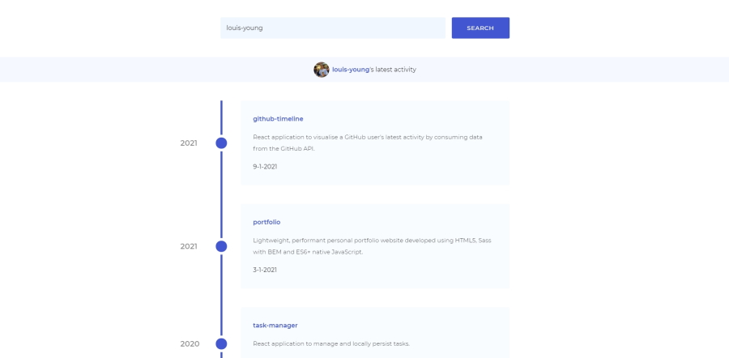

# GitHub Activity Visualiser

React application to visualise a GitHub user's latest activity by making requests to the GitHub API.

## Description

This is an application which visualises the GitHub activity of a given user by providing a slick user interface with a timeline of a user's recent activity. 

## Motivation

I built this application to learn React and to practice data fetching from a REST API and rendering fetched data.

### Available Scripts

In the project directory, you can run:

#### `npm start`

Runs the app in the development mode.\
Open [http://localhost:3000](http://localhost:3000) to view it in the browser.

The page will reload if you make edits.\
You will also see any lint errors in the console.

#### `npm test`

Launches the test runner in the interactive watch mode.\
See the section about [running tests](https://facebook.github.io/create-react-app/docs/running-tests) for more information.

#### `npm run build`

Builds the app for production to the `build` folder.\
It correctly bundles React in production mode and optimizes the build for the best performance.

The build is minified and the filenames include the hashes.\
Your app is ready to be deployed!

See the section about [deployment](https://facebook.github.io/create-react-app/docs/deployment) for more information.
